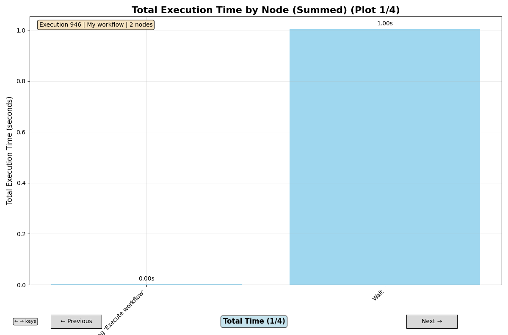

# n8n Workflow Execution Data Analyzer

This Python application analyzes n8n workflow execution data, providing insights into execution patterns, performance metrics, and timelines.

## Features

- Fetch execution data from n8n API
- Analyze execution timelines and performance
- Create visual timeline plots
- Generate performance summaries
- Support for both single execution and bulk analysis

## Setup

1. Install dependencies:
```bash
pip install -r requirements.txt
```

2. Configure your n8n API credentials in the `.env` file:
```
N8N_API_KEY=your_api_key_here
N8N_BASE_URL=https://your-n8n-instance.com
```

## Usage

### Analyze a specific execution:
```bash
python3 n8n-timings.py --execution-id 946
```

* Navigate between plots with <kbd>A</kbd>/<kbd>D</kbd> or <kbd>←</kbd>/<kbd>→</kbd> arrow keys

## Command Line Options

- `--execution-id`: Analyze a specific execution by ID

## Output

The application generates:
1. **Performance Summary**: Console output with execution details
2. **Timeline Plot**: Visual representation of node execution timeline
3. **Duration Chart**: Bar chart showing execution times per node

